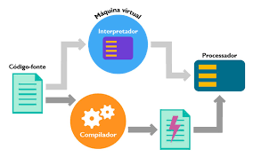

# Introdução ao Python

Python é uma linguagem extremamente poderosa e simples de ser aprendida de alto nível e multiparadigmas. É uma linguagem de tipagem dinâmica, elegante e de um escopo léxico distinto.

A sintaxe básica do Python é bastante simples, existem inúmeras bibliotecas de suporte às aplicações e diversas estruturas de dados contidas na sintaxe como _tuplas_, _listas_ e _dicionários_.

Por ser bastante simples e com muitas bibliotecas à disposição, Python é uma das primeiras linguagens a ser aprendidas por alunos de programação atualmente.

Apesar de ser uma linguagem interpretada, existe todo um processo de compilação que é transparente para o programador, mas que pode ser explicada com a transformação do código texto (a partir do .py) em _bytecode_ que, por sua vez, é interpretado por uma máquina virtual, do inglês _virtual machine_ ou VM.

Como todas as linguagens, o Python também tem convenções acerca do estilo de código a ser escrito, a comunidade definiu o PEP-8 como um guia de estilos com os seguintes destaques:

- Use 4 espaços para indentação
- Não misture Tabs e espaços
- Tamanho máximo da linha é 79 caracteres
- As variáveis de nome composto devem ser separadas por underscore, o padrão SnakeCase (\_). Ex: nome_usuario
- As classes devem adotar o padrão CamelCase em sua nomenclatura. Ex: AnimalDomestico
